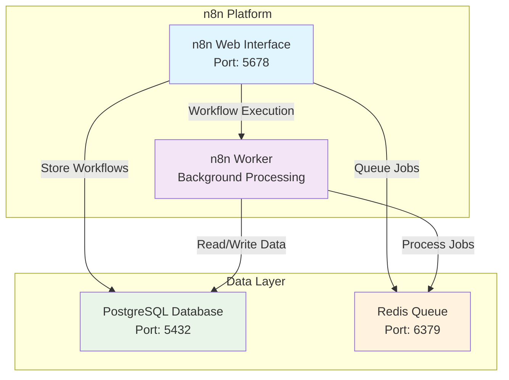

# n8n Workflow Automation Platform

A complete n8n workflow automation platform setup using Docker Compose with PostgreSQL database and Redis queue management.

## Overview

This project provides a production-ready n8n instance with:
- **n8n Core**: Main workflow automation platform
- **n8n Worker**: Background job processing
- **PostgreSQL**: Database for workflow storage
- **Redis**: Queue management for workflow execution

## Features

- **Production Ready**: Configured with queue mode for better performance
- 🔒 **Secure**: Environment-based configuration with encryption key support
- 📊 **Scalable**: Separate worker instance for background processing
- 🗄️ **Persistent Storage**: PostgreSQL database with health checks
- ⚡ **Fast Processing**: Redis-based queue system
- 🔄 **Auto-restart**: Services automatically restart on failure

## Prerequisites

- Docker and Docker Compose installed
- Basic understanding of Docker containers

## Quick Start

1. **Clone the repository**
   ```bash
   git clone <your-repo-url>
   cd n8n
   ```

2. **Create environment file**
   ```bash
   cp .env.example .env
   ```
   
   Edit `.env` with your configuration:
   ```env
   # Database Configuration
   POSTGRES_DB=n8n
   POSTGRES_USER=postgres
   POSTGRES_PASSWORD=your_secure_password
   POSTGRES_NON_ROOT_USER=n8n_user
   POSTGRES_NON_ROOT_PASSWORD=your_n8n_password
   
   # n8n Configuration
   ENCRYPTION_KEY=your_32_character_encryption_key
   ```

3. **Start the services**
   ```bash
   docker-compose up -d
   ```

4. **Access n8n**
   Open your browser and navigate to: `http://localhost:5678`

## Configuration

### Environment Variables

| Variable | Description | Required |
|----------|-------------|----------|
| `POSTGRES_DB` | PostgreSQL database name | Yes |
| `POSTGRES_USER` | PostgreSQL root user | Yes |
| `POSTGRES_PASSWORD` | PostgreSQL root password | Yes |
| `POSTGRES_NON_ROOT_USER` | n8n database user | Yes |
| `POSTGRES_NON_ROOT_PASSWORD` | n8n database password | Yes |
| `ENCRYPTION_KEY` | 32-character encryption key for n8n | Yes |

### Service Ports

- **n8n Web Interface**: `5678`
- **PostgreSQL**: `5432`
- **Redis**: `6379`

## Architecture



## Data Persistence

- **n8n Data**: Stored in `./n8n_data/` directory
- **PostgreSQL Data**: Stored in Docker volume `db_storage`
- **Redis Data**: Stored in `./redis-data/` directory

## Management Commands

### Start Services
```bash
docker-compose up -d
```

### Stop Services
```bash
docker-compose down
```

### View Logs
```bash
# All services
docker-compose logs -f

# Specific service
docker-compose logs -f n8n
docker-compose logs -f n8n-worker
```

### Restart Services
```bash
docker-compose restart
```

### Update Services
```bash
docker-compose pull
docker-compose up -d
```

## Backup and Restore

### Backup Database
```bash
docker-compose exec postgres pg_dump -U postgres n8n > backup.sql
```

### Restore Database
```bash
docker-compose exec -T postgres psql -U postgres n8n < backup.sql
```

## Troubleshooting

### Common Issues

1. **Services won't start**
   - Check if ports 5678, 5432, or 6379 are already in use
   - Verify `.env` file exists and has correct values

2. **Database connection issues**
   - Wait for PostgreSQL health check to pass
   - Check database credentials in `.env`

3. **PostgreSQL user creation issues**
   - **IMPORTANT**: PostgreSQL converts usernames to lowercase by default
   - If you get "role does not exist" errors, check that usernames in `.env` are lowercase
   - Example: Use `n8n_user` instead of `N8N_USER` or `N8n_User`
   - Verify user exists: `docker-compose exec postgres psql -U postgres -d n8n -c "\du"`
   - If user creation failed, manually run: `docker-compose exec postgres psql -U postgres -d n8n -f /docker-entrypoint-initdb.d/init-data.sh`

4. **n8n not accessible**
   - Ensure n8n service is running: `docker-compose ps`
   - Check logs: `docker-compose logs n8n`

### Clean Reset Commands

When you need to completely reset the system (⚠️ **WARNING**: This will delete all data):

1. **Stop all services**
   ```bash
   docker-compose down
   ```

2. **Remove all volumes and data**
   ```bash
   # Remove Docker volumes
   docker volume rm n8n_db_storage n8n_n8n_data n8n_redis_data
   
   # Remove local directories (if using bind mounts)
   rm -rf ./n8n-data ./redis-data
   ```

3. **Clean up containers and images (optional)**
   ```bash
   # Remove stopped containers
   docker container prune -f
   
   # Remove unused images
   docker image prune -f
   ```

4. **Start fresh**
   ```bash
   docker-compose up -d
   ```

### Health Checks

All services include health checks:
- PostgreSQL: `pg_isready` check
- Redis: Built-in health monitoring
- n8n: Queue health check active

## Security Considerations

- Change default passwords in production
- Use strong encryption keys (32 characters)
- Consider using Docker secrets for sensitive data
- Regularly update Docker images
- Backup your data regularly

## Contributing

1. Fork the repository
2. Create a feature branch
3. Make your changes
4. Test thoroughly
5. Submit a pull request

## License

This project is licensed under the MIT License - see the LICENSE file for details.

## Support

For n8n-specific issues, refer to the [official n8n documentation](https://docs.n8n.io/).

For Docker-related issues, check the [Docker documentation](https://docs.docker.com/).
